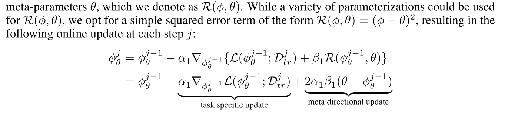
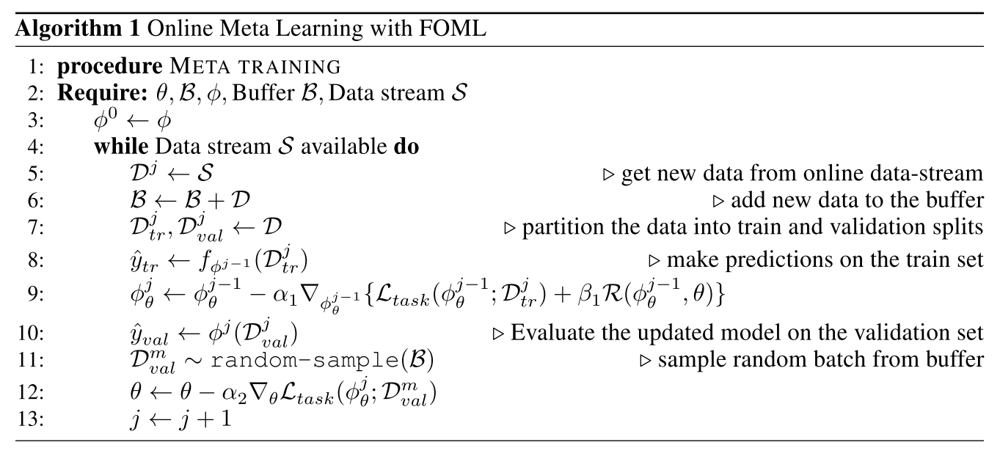
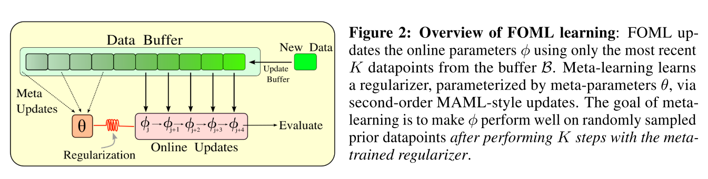

# FULLY ONLINE META-LEARNING WITHOUT TASK BOUNDARIES

## **TLDR**

MAML saga by Chelsea Finn & Sergey Levine. MAML, Online MAML, Fully Online MAML, ...  
  
Given online parameter $\phi$, meta parameter $\theta$,  
update $\phi$ at the inner loop, based on $L_{task}(\phi)$ and $Regularization(\phi, \theta)$,  
$\rightarrow$ Sample some of the data $D_{rand}$ from an accumulated data buffer $B$,  
$\rightarrow$ update $\theta$ based on $L_{task}(\phi, D_{rand})$.  

## Quick Look

- **Authors & Affiliation**: Jathushan Rajasegaran, Chelsea Finn, Sergey Levine
- **Link**: <https://arxiv.org/pdf/2202.00263.pdf>
- **Comments**: arXiv paper  
- **Relevance**: 4, relevant enough.  

# Research Topic

- **Category** (General): Meta Learning
- **Category** (Specific): Meta Learning, MAML, Online Meta Learning

# Paper Summary (What)

- Reason why previous MAML families were not fully online?  
> an adaptation process, whose result is discarded completely at the end of the task, and a meta-training process, which does not influence the current task at all, and is only used for forward transfer into future tasks.
- Why is this 'fully online' for now?  
> does not need to periodically “reset” the adapted parameters back to the meta-parameters, and does not require any ground truth knowledge of task boundaries.
- Inner Loop Design:  
  
Task-specific update is same as before.  
'Meta Directional' update is done as a form of regularization between meta parameter $\theta$ and online paramter $\phi$.  
$\rightarrow$ is this really 'that' novel enough?  
- Total Process  

Accumulate data samples into a buffer $B$,  
execute inner loop for train set,  
sample some amount of data from the buffer $B$,  
execute outer loop based on the sampled data.  
- Process as an image

- Thoughts
    - Looks very similar with conventional distillation (or it really is the same?).
    - What is the difference with the conventional distillation methods?
    - (Random) Distillation is not aware of the distribution of its sampling pool and the sample. This is not an efficient way to utilize past experience, thus it is speculated that FOML will share the same limitation.  
    - What if we can just forward transfer the implicit features instead of data buffers?


# Notable References

Basically its MAML prequels.  
[MAML](https://proceedings.mlr.press/v70/finn17a/finn17a.pdf)  
[Online MAML](https://proceedings.mlr.press/v97/finn19a/finn19a.pdf)  
[La-maml: Look-ahead meta learning for continual learning](https://arxiv.org/pdf/2007.13904.pdf)  
[Continuous meta-learning without tasks.](https://proceedings.neurips.cc/paper/2020/file/cc3f5463bc4d26bc38eadc8bcffbc654-Paper.pdf)  
[Meta-learning representations for continual learning.](https://proceedings.neurips.cc/paper/2019/file/f4dd765c12f2ef67f98f3558c282a9cd-Paper.pdf)  
[Meta-sgd](https://arxiv.org/pdf/1707.09835.pdf)  
몇 개는 EndNote에 넣어놓고 몇 달째 방치하고 있었다. *반성 해야한다.*  

# Footnote
아래와 같은 양식을 활용한다.  

```text
# 
## Quick Look
- **Authors & Affiliation**: [Authors][Affiliations]
- **Link**: [Paper link]
- **Comments**: [e.g. Published at X / arXiv paper / in review.]
- **TLDR**: [One or at most two line summary]
- **Relevance**: [Score between 1 and 5, stating how relevant this paper is to your work. Usually filled in at the end.]
# Research Topic
- **Category** (General):
- **Category** (Specific):
# Paper Summary (What)
[Summary of the paper - a few sentences with bullet points. What did they do?]
```
